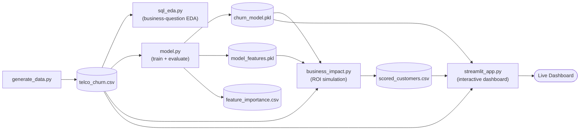

# Customer-Churn-Prediction
# 📉 Customer Churn Prediction & Retention Strategy

**An end-to-end data science project that identifies which customers are about to leave, quantifies the revenue at stake, and proves the ROI of doing something about it.**

[](https://www.python.org/)
[](https://scikit-learn.org/)
[](https://streamlit.io/)
[](https://www.sqlite.org/)
[](#license)

**🔗 Live demo:** _[add your deployed Streamlit link here after deployment]_

---

## Table of Contents

- [Business Problem](#business-problem)
- [Key Results](#key-results-at-a-glance)
- [Project Architecture](#project-architecture)
- [Repository Structure](#repository-structure)
- [Tech Stack](#tech-stack)
- [Methodology](#methodology)
- [Key Findings](#key-findings)
- [Model Performance](#model-performance)
- [Business Impact & ROI](#business-impact--roi)
- [Dashboard](#dashboard)
- [Getting Started](#getting-started)
- [Deployment](#deployment)
- [Skills Demonstrated](#skills-demonstrated)
- [Limitations & Future Work](#limitations--future-work)
- [License](#license)
- [Author](#author)

---

## Business Problem

A telecom company is losing customers to churn, but has no systematic way to answer three questions that matter to the business:

1. **Who** is likely to leave?
2. **Why** are they leaving?
3. **Where** should a limited retention budget be spent to get the best return?

This project builds the full pipeline needed to answer all three — from SQL-driven exploratory analysis, to a trained and evaluated classification model, to a dollar-quantified business case for a retention campaign, wrapped in an interactive dashboard a non-technical stakeholder can actually use.

> **Note on data:** This project uses a synthetic dataset of 5,000 customers (`generate_data.py`) built to mirror the structure and churn drivers of the well-known [Telco Customer Churn](https://www.kaggle.com/datasets/blastchar/telco-customer-churn) dataset (month-to-month contracts churn more, low tenure churns more, etc.). Every technique used here — the SQL patterns, the modeling approach, the evaluation methodology — transfers directly to the real dataset or to real production data.

---

## Key Results at a Glance

| Metric | Value |
|---|---|
| Customers analyzed | 5,000 |
| Overall churn rate | **30.7%** |
| Month-to-month vs. two-year churn | **37.7% vs. 20.9%** (~1.8x) |
| New customers (0–6 mo tenure) churn rate | **41.6%** |
| Highest-risk segment churn rate | **44.7%** (month-to-month + no tech support + electronic check) |
| Annual revenue at risk (month-to-month segment) | **$841K** |
| Top 20% risk-scored customers capture | **69.6%** of all actual churners |
| Simulated retention campaign ROI | **10.9x** ($15K spend → ~$179K saved) |

---

## Project Architecture

The pipeline runs as a sequence of independent, single-responsibility scripts — each one reads what it needs from disk and writes an artifact for the next stage, which mirrors how a real analytics/ML pipeline is structured in production.



`churn_dashboard.jsx` is a standalone React/Recharts component that reproduces the dashboard's KPI cards and charts with static data — useful for embedding the results directly into a portfolio site without running a Streamlit server.

---

## Repository Structure

```
.
├── generate_data.py        # Synthetic dataset generation with realistic churn drivers
├── sql_eda.py               # SQL (sqlite3) business-question-driven exploratory analysis
├── model.py                  # Feature engineering, training, and evaluation (LogReg + RF)
├── business_impact.py         # Churn risk scoring + retention campaign ROI simulation
├── streamlit_app.py            # Interactive dashboard (KPIs, charts, live scoring tool)
├── churn_dashboard.jsx          # Static React/Recharts dashboard component (portfolio embed)
├── requirements.txt              # Python dependencies
│
├── telco_churn.csv                # Generated dataset (5,000 customers)
├── scored_customers.csv            # Every customer with a model-assigned churn risk score
├── churn_model.pkl                  # Trained Random Forest model artifact
├── model_features.pkl                # Ordered feature list used at inference time
│
└── README.md                          # This file
```

---

## Tech Stack

| Layer | Tools |
|---|---|
| Data generation | Python, NumPy, Pandas |
| Exploratory analysis | SQL (SQLite via `sqlite3`), Pandas |
| Modeling | scikit-learn — Logistic Regression, Random Forest |
| Evaluation | Precision, Recall, F1, ROC-AUC, stratified train/test split |
| Business analysis | Custom ROI simulation on model-scored customers |
| Visualization / App | Streamlit, Plotly, React + Recharts |
| Model persistence | joblib |

---

## Methodology

### 1. Data generation
`generate_data.py` produces 5,000 synthetic customers with realistic, interlocking churn drivers baked into the underlying probability model — contract type, tenure, internet service, payment method, tech support/security add-ons, and pricing all influence churn likelihood the way they do in real telecom data.

### 2. SQL-driven exploratory analysis
`sql_eda.py` loads the dataset into an in-memory SQLite database and runs a set of business-question-first queries: overall churn rate, churn by contract type, revenue at risk by segment, churn by tenure bucket, and a compound highest-risk segment query. This mirrors how a data analyst would explore the problem before ever touching a model — establishing the baseline facts a model's results need to be checked against.

### 3. Feature engineering & modeling
`model.py`:
- One-hot encodes categorical fields (`pd.get_dummies`, `drop_first=True`)
- Splits data 80/20 with **stratification on the target** to preserve the 30.7% churn rate in both train and test sets
- Trains two models: **Logistic Regression** (interpretable baseline, `class_weight='balanced'`) and **Random Forest** (200 trees, max depth 8, `class_weight='balanced'`)
- Evaluates both on precision, recall, F1, and ROC-AUC, and prints a full confusion matrix
- Extracts feature importances (Random Forest) and coefficients (Logistic Regression) to explain *why* the model flags a customer as high-risk — not just *that* it does

**Design choice — optimizing for recall over raw accuracy:** in a churn use case, a missed churner (false negative) costs the business a lost customer, while a false positive just costs a wasted retention offer. Both models use `class_weight='balanced'` specifically to push recall up, since catching more true churners matters more than minimizing false alarms.

### 4. Business impact simulation
`business_impact.py` loads the trained model, scores every customer with a churn probability, and simulates a realistic retention campaign: target the top 20% highest-risk customers, assume a $15/customer outreach cost and a 30% save rate, and calculate the resulting ROI. This is the step that translates a model metric (ROC-AUC) into a number a business stakeholder actually cares about (dollars).

### 5. Interactive dashboard
`streamlit_app.py` ties everything together into a single-page app: KPI summary, segment-level churn charts, a risk-score distribution, a live "score a hypothetical customer" tool that calls the trained model directly, and a table of the top at-risk customers.

---

## Key Findings

- **Contract type is the single strongest lever.** Month-to-month customers churn at **37.7%**, nearly double the **20.9%** rate for two-year contracts — and it shows up as a top feature in both the Random Forest importances and the Logistic Regression coefficients (`contract_Two year` and `contract_One year` are the two largest *negative* churn coefficients).
- **The first six months are the danger zone.** New customers (0–6 months tenure) churn at **41.6%**, more than double the rate of customers with 4+ years of tenure (**17.3%**). Onboarding and early-lifecycle engagement is a clear, actionable weak point.
- **Risk factors compound.** Customers who are simultaneously on a month-to-month contract, have no tech support, and pay by electronic check churn at **44.7%** — well above any single factor in isolation. This is the kind of multi-condition segment a business team would want to target first.
- **Revenue exposure is concentrated.** Month-to-month customers alone represent **$841K/year** in at-risk revenue, more than the one-year and two-year segments combined.
- **Payment method and service add-ons matter.** Electronic check payment and lack of tech support/online security both push churn probability up, both in the SQL segment analysis and in the model's learned coefficients.

---

## Model Performance

Evaluated on a held-out, stratified 20% test set (1,000 customers, 30.7% churn rate preserved):

| Model | Precision | Recall | F1 Score | ROC-AUC |
|---|---|---|---|---|
| Logistic Regression | 0.397 | **0.606** | 0.480 | 0.650 |
| Random Forest | 0.412 | 0.450 | 0.430 | 0.642 |

**Reading these numbers:** Logistic Regression wins on recall (catches 60.6% of true churners vs. 45.0% for Random Forest) — consistent with the design decision to prioritize catching churners over raw accuracy. Random Forest is used for the final risk-scoring pipeline because its feature importances give a cleaner, non-linear read on which factors matter most, and its precision is slightly higher, which matters when scoring the specific "top 20%" segment used in the ROI simulation.

**Top churn drivers (Random Forest feature importance):**

| Rank | Feature | Importance |
|---|---|---|
| 1 | Monthly charges | 0.187 |
| 2 | Total charges | 0.182 |
| 3 | Tenure (months) | 0.174 |
| 4 | Two-year contract | 0.059 |
| 5 | Electronic check payment | 0.054 |

---

## Business Impact & ROI

Simulated retention campaign, targeting the model's top 20% highest-risk customers (1,000 of 5,000):

| Metric | Value |
|---|---|
| Customers targeted | 1,000 |
| Actual churners captured in this group | 696 (**69.6%** of the targeted group) |
| Annualized revenue at risk in this group | $598,252 |
| Campaign cost (@ $15/customer outreach) | $15,000 |
| Assumed save rate | 30% |
| Customers retained (estimated) | 208 |
| Revenue saved (estimated) | **$178,788** |
| **Return on investment** | **10.9x** |

The core argument: instead of a blanket retention discount sent to all 5,000 customers, targeting only the model's top 20% risk segment captures the large majority of actual churners (69.6%) at a fraction of the cost — turning a $15K spend into an estimated $179K in retained revenue.

---

## Dashboard

`streamlit_app.py` provides:

- **KPI row** — overall churn rate, revenue at risk, customers scored, campaign ROI
- **Churn rate by contract type** (bar chart) and **risk score distribution** (histogram, split by actual outcome)
- **"Score a customer" tool** — enter a hypothetical customer's contract, tenure, charges, payment method, and support status, and get a live churn probability back from the trained model, with a color-coded risk flag
- **Top at-risk customers table** — the 20 highest-risk real customers in the dataset, ready to hand to a retention team

`churn_dashboard.jsx` reproduces the KPI cards and segment charts as a standalone React component (Recharts + lucide-react icons) for embedding outside of Streamlit, e.g. in a portfolio site.

---

## Getting Started

### Prerequisites
- Python 3.10+
- pip

### Installation

```bash
git clone <this-repo-url>
cd customer-churn-prediction-retention-strategy
pip install -r requirements.txt
```

### Run the full pipeline

```bash
python generate_data.py       # generates telco_churn.csv
python sql_eda.py             # prints SQL-based EDA results to console
python model.py                # trains models, prints evaluation, saves churn_model.pkl
python business_impact.py       # scores customers, prints ROI, saves scored_customers.csv
streamlit run streamlit_app.py   # launches the dashboard at localhost:8501
```

Each script can also be re-run independently once its required upstream artifacts exist (e.g. `streamlit_app.py` only needs `telco_churn.csv`, `churn_model.pkl`, `model_features.pkl`, and `scored_customers.csv` already present).

---

## Deployment

Deploy the dashboard for free on **Streamlit Community Cloud**:

1. Push this repository to GitHub
2. Go to [streamlit.io/cloud](https://streamlit.io/cloud) and sign in with GitHub
3. Click **New app**, select this repo, and set the entry point to `streamlit_app.py`
4. Deploy — you'll get a public URL in a couple of minutes

Once deployed, update the **Live demo** link at the top of this README.

---

## Skills Demonstrated

- **SQL:** aggregations, `GROUP BY`, conditional (`CASE WHEN`) aggregation, multi-condition filtering, business-question-first query design
- **Data science:** feature engineering, stratified train/test splitting, model comparison, precision/recall/F1/ROC-AUC evaluation, feature importance interpretation
- **ML engineering:** model persistence with `joblib`, reproducible inference (matching training-time feature columns at prediction time)
- **Business analysis:** translating model output into a dollar-denominated ROI case, segment prioritization under a budget constraint
- **Product/dashboard building:** Streamlit + Plotly interactive app, plus a portfolio-ready static React component

---

## Limitations & Future Work

- **Synthetic data:** built without live data access, so it mirrors realistic churn drivers but isn't real customer behavior. Swapping in the real [Telco Customer Churn dataset](https://www.kaggle.com/datasets/blastchar/telco-customer-churn) (or live production data) is a drop-in replacement — the pipeline doesn't change.
- **Assumed save rate:** the 30% retention-campaign save rate is an assumption, not a measured outcome. A real deployment should A/B test the campaign itself rather than assuming a fixed save rate.
- **Explainability:** add [SHAP](https://github.com/shap/shap) values for per-customer explanations ("why is *this specific* customer flagged high-risk"), which is more actionable for a retention team than global feature importance alone.
- **Model tuning:** hyperparameter search (e.g. `GridSearchCV`) and additional model families (XGBoost/LightGBM) could be benchmarked against the current Logistic Regression / Random Forest baseline.
- **Monitoring:** in production, add drift monitoring on the input features and periodic retraining, since churn drivers can shift over time.

---

## License

This project is released under the [MIT License](LICENSE).

---

## Author

**Sumit Kilaniya**
GitHub: [@SumitKilaniya](https://github.com/SumitKilaniya)

If you found this project useful or have suggestions, feel free to open an issue or reach out.
